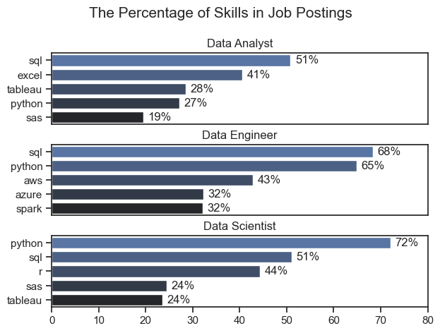
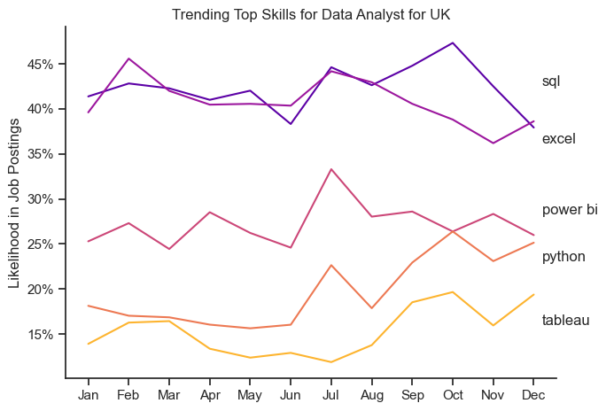
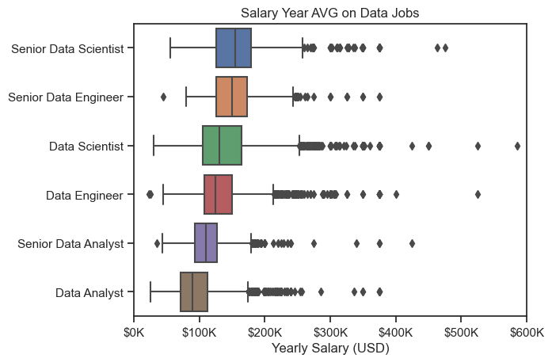
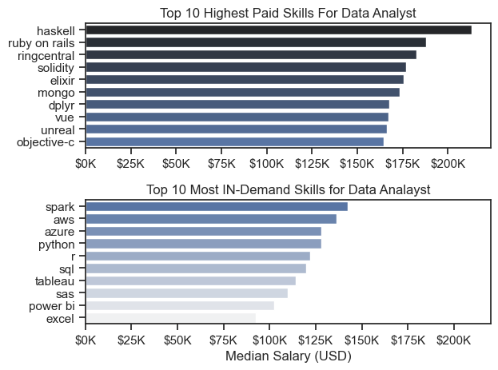

# The Analysis

## 1. What are the most demanded skills for the top 3 most popular data roles?

To find the most demanded skills for the top 3 most popular data roles. I filtered out those positions by which ones were the most popular, and got the top 5 skills for these top 3 roles. This query highlights the most popular job titles and their top skills, showing which skills I should pay attention to depending on the role I'm targeting.

View my notebook with detailed steps here:
[Jobs_Demanded_Skills.ipynb](3_Project/Jobs_Demanded_Skills.ipynb)

## Visualiza Data 
```python
fig , ax = plt.subplots(len(job_title),1)

sns.set_theme(style='ticks')

for i ,job_titles in enumerate(job_title):
    df_plot = df_skill_perc[df_skill_perc['job_title_short'] == job_titles].head(5)
    sns.barplot(data=df_plot ,x='skill_percent',y='job_skills' ,ax=ax[i] ,palette='dark:b_r' ) 
    ax[i].set_title(job_titles)
    ax[i].set_ylabel('')
    ax[i].set_xlabel('')
    ax[i].set_xlim(0,80)
    # ax[i].legend().set_visible(False) there is a comment when you do ploting using sns it doesnt take ax[i].legend
    for n , v in enumerate(df_plot['skill_percent']):
        ax[i].text(v + 1, n ,f'{v:.0f}%' ,va='center')
    if i != len(job_title) -1:
        ax[i].set_xticks([])

fig.suptitle('The Percentage of Skills in Job Postings',fontsize=15)
plt.tight_layout(h_pad=.5)
plt.show()

```



### Insights

- SQL is the most requested skill for Data Analysts and Data Scientists, with it in over half the job postings for both roles. For Data Engineers, Python is the most sought-after skill, appearing in 68% of job postings.

- Data Engineers require more specialized technical skills (AWS, Azure, Spark) compared to Data Analysts and Data Scientists who are expected to be proficient in more general data management and analysis tools (Excel, Tableau).
- Python is a versatile skill, highly demanded across all three roles, but most prominently for Data Scientists (72%) and Data Engineers (65%).

## 2. How are in-demand skills trending for Data Analysts?
### To find how skills are trending in 2023 for Data Analysts, I filtered data analyst positions and grouped the skills by the month of the job postings. This got me the top 5 skills of data analysts by month, showing how popular skills were throughout 2023.

View my notebook with detailed steps here: [Skills_Trend](3_Project/Skills_Trend.ipynb)

## Visualize Data
``` python
df_plot= df_UK_perc.iloc[: , :5]

sns.lineplot(data=df_plot ,dashes=False , palette='plasma')
sns.set_theme(style='ticks')
sns.despine()

plt.title('Trending Top Skills for Data Analyst for UK')
plt.ylabel('Likelihood in Job Postings')
plt.xlabel('')
plt.legend().remove()
plt.tight_layout()

from matplotlib.ticker import PercentFormatter
ay= plt.gca()
ay.yaxis.set_major_formatter(PercentFormatter(decimals=0))

for i in range(5):
    plt.text(11.2 , df_plot.iloc[-2,i] ,df_plot.columns[i])

```



## Insights
- SQL remains the most consistently demanded skill throughout the year, although it shows a gradual decrease in demand.
- Excel experienced a significant increase in demand starting around September, surpassing both Python and Tableau by the end of the year.
 - Both Python and Tableau show relatively stable demand throughout the year with some fluctuations but remain essential skills for data analysts. Power BI, while less demanded compared to the others, shows a slight upward trend towards the year's end.


## 3. How well do jobs and skills pay for Data Analysts?
### To identify the highest-paying roles and skills, I only got jobs in the United States and looked at their median salary. But first I looked at the salary distributions of common data jobs like Data Scientist, Data Engineer, and Data Analyst, to get an idea of which jobs are paid the most.

View my notebook with detailed steps here:[Salary_analysis](3_Project/Salary_analysis.ipynb)

### Visualize Data 

``` Python
sns.boxplot(data=df_US_top6 , x='salary_year_avg',y='job_title_short' , order=job_order)
sns.set_theme(style='ticks')

plt.title('Salary Year AVG on Data Jobs')
plt.xlabel('Yearly Salary (USD)')
plt.ylabel('')
plt.xlim(0,600000)
ticks_x = plt.FuncFormatter(lambda y, pos :f'${int(y/1000)}K')
plt.gca().xaxis.set_major_formatter(ticks_x)
plt.show()
```



## Highest Paid & Most Demanded Skills for Data Analysts

### Next, I narrowed my analysis and focused only on data analyst roles. I looked at the highest-paid skills and the most in-demand skills. I used two bar charts to showcase these.

### Visualize Data
``` Python
fig ,ax = plt.subplots(2,1)

sns.set_theme(style='ticks')
sns.barplot(data=df_US_median , x='median',y=df_US_median.index , ax=ax[0],palette='dark:b')
ax[0].xaxis.set_major_formatter(plt.FuncFormatter(lambda x , pos: f'${int(x/1000)}K'))
ax[0].set_title('Top 10 Highest Paid Skills For Data Analyst')
ax[0].set_ylabel('')
ax[0].set_xlabel('')


sns.barplot(data=df_US_count , x='median', y=df_US_count.index ,ax=ax[1], palette='light:b_r')
ax2 = plt.FuncFormatter(lambda y, pos :f'${int(y/1000)}K')
plt.gca().xaxis.set_major_formatter(ax2)
plt.xlim(0,220000)
plt.title('Top 10 Most IN-Demand Skills for Data Analayst')
plt.ylabel('')
plt.xlabel('Median Salary (USD)')
plt.tight_layout()
``` 


### Insights

 - The top graph shows specialized technical skills like dplyr, Bitbucket, and Gitlab are associated with higher salaries, some reaching up to $200K, suggesting that advanced technical proficiency can increase earning potential.

 - The bottom graph highlights that foundational skills like Excel, PowerPoint, and SQL are the most in-demand, even though they may not offer the highest salaries. This demonstrates the importance of these core skills for employability in data analysis roles.

 - There's a clear distinction between the skills that are highest paid and those that are most in-demand. Data analysts aiming to maximize their career potential should consider developing a diverse skill set that includes both high-paying specialized skills and widely demanded foundational skills.

 ## 4. What are the most optimal skills to learn for Data Analysts?

 To identify the most optimal skills to learn ( the ones that are the highest paid and highest in demand) I calculated the percent of skill demand and the median salary of these skills. To easily identify which are the most optimal skills to learn.

View my notebook with detailed steps here: [Optimal_Skills](3_Project/Optimal_skills.ipynb)

## Visualize Data

``` python
from adjustText import adjust_text

#df_high_demand_skills.plot(kind='scatter', x='skill_percent',y='median_salary')
sns.scatterplot(
    data=df_plot,
    x='skill_percent',
    y='median_salary',
    hue='technology'
)
plt.tight_layout()
sns.despine()
plt.title('Top 10 optimal skills for Data Analyst')
texts=[]

for i , txt in enumerate(df_high_demand_skills.index):
    texts.append(plt.text(df_high_demand_skills['skill_percent'].iloc[i],df_high_demand_skills['median_salary'].iloc[i],txt))

adjust_text(texts,arrowprops=dict(arrowstyle='->',color='gray'))

ax =plt.gca()
ax.xaxis.set_major_formatter(lambda x ,_ : f'{int(x)}%')
ay= plt.gca()
ay.yaxis.set_major_formatter(lambda y ,_ : f'{int(y/1000)}K')
plt.xlabel('Skill Percentage')
plt.ylabel('Median Salary(USD)')
plt.show()
```

### Results


### Insights
 - The scatter plot shows that most of the programming skills (colored blue) tend to cluster at higher salary levels compared to other categories, indicating that programming expertise might offer greater salary benefits within the data analytics field.

 - The database skills (colored orange), such as Oracle and SQL Server, are associated with some of the highest salaries among data analyst tools. This indicates a significant demand and valuation for data management and manipulation expertise in the industry.

 - Analyst tools (colored green), including Tableau and Power BI, are prevalent in job postings and offer competitive salaries, showing that visualization and data analysis software are crucial for current data roles. This category not only has good salaries but is also versatile across different types of data tasks.

 # What I Learned

 Throughout this project, I deepened my understanding of the data analyst job market and enhanced my technical skills in Python, especially in data manipulation and visualization. Here are a few specific things I learned:
 

 - Advanced Python Usage: Utilizing libraries such as Pandas for data manipulation, Seaborn and Matplotlib for data visualization, and other libraries helped me perform complex data analysis tasks more efficiently.
 - Data Cleaning Importance: I learned that thorough data cleaning and preparation are crucial before any analysis can be conducted, ensuring the accuracy of insights derived from the data.
 - Strategic Skill Analysis: The project emphasized the importance of aligning one's skills with market demand. Understanding the relationship between skill demand, salary, and job availability allows for more strategic career planning in the tech industry.

# Insights 
This project provided several general insights into the data job market for analysts:

  - Skill Demand and Salary Correlation: There is a clear correlation between the demand for specific skills and the salaries these skills command. Advanced and specialized skills like Python and Oracle often lead to higher salaries.
  - Market Trends: There are changing trends in skill demand, highlighting the dynamic nature of the data job market. Keeping up with these trends is essential for career growth in data analytics.
 - Economic Value of Skills: Understanding which skills are both in-demand and well-compensated can guide data analysts in prioritizing learning to maximize their economic returns.


# Challenges I Faced


This project was not without its challenges, but it provided good learning opportunities:

 - Data Inconsistencies: Handling missing or inconsistent data entries requires careful consideration and thorough data-cleaning techniques to ensure the integrity of the analysis.
 - Complex Data Visualization: Designing effective visual representations of complex datasets was challenging but critical for conveying insights clearly and compellingly.
 - Balancing Breadth and Depth: Deciding how deeply to dive into each analysis while maintaining a broad overview of the data landscape required constant balancing to ensure comprehensive coverage without getting lost in details.


 # Conclusion

 This exploration into the data analyst job market has been incredibly informative, highlighting the critical skills and trends that shape this evolving field. The insights I got enhance my understanding and provide actionable guidance for anyone looking to advance their career in data analytics. As the market continues to change, ongoing analysis will be essential to stay ahead in data analytics. This project is a good foundation for future explorations and underscores the importance of continuous learning and adaptation in the data field.
